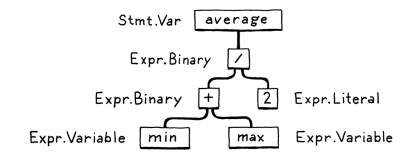

# Chapter 1

A Compiler read files in one language, translates them, and output files in another language. You can implement a compiler in any language, including the same language it compiles, a process called **self-hosting**.

# Chapter 2

## Parts of a language

### Scanning
Also known as **lexing**. Takes in the linear stream of characters and chunks them together into a series more akin to "words". Each word is called a **token**. Tokens can be single character like (  or several characters like 123.

Some characters in the source file don't mean anything like whitespace. These characters are usually discarded by the scanner. 

### Parsing
**Parser** takes the flat sequence of tokens and builds a tree structure that mirrors the nested nature of the grammar.

# Chapter 4

## Scanning
Scan through list of characters and group them together into the smallest sequences that still represent something. Each of these blobs of character is called a **lexeme**

`var language = "lox"'`

lexemes are: `var`, `language`, `=`, `"lox"`, `;`